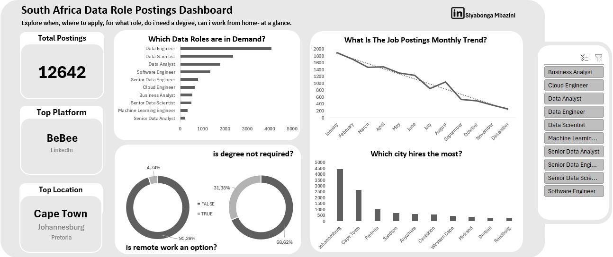
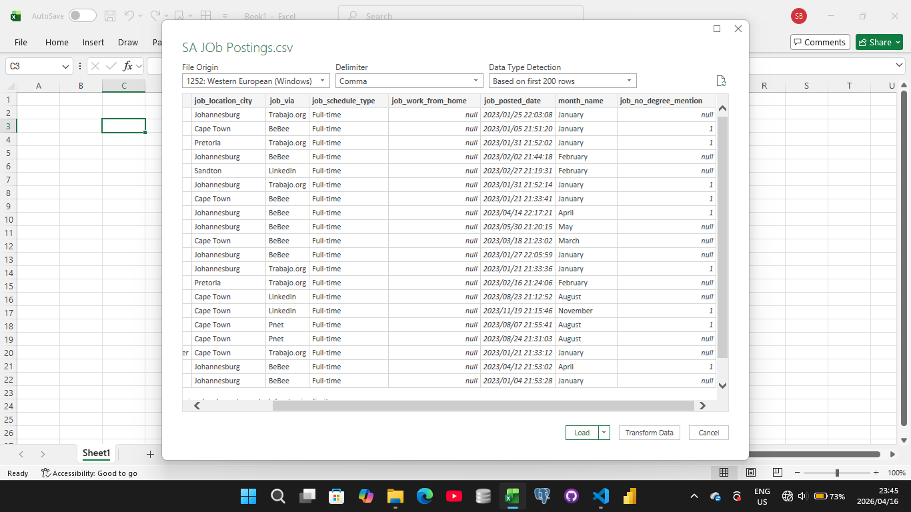
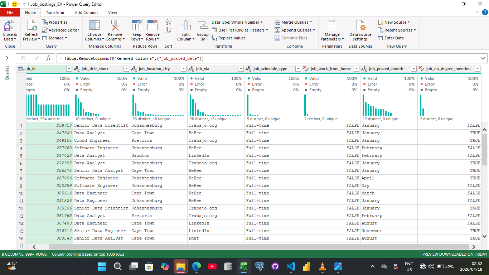

# South Africa Data Roles Job Market Analysis
## Introduction

**Am I wasting my time learning Data Analysis?**
That is the question I kept asking when I started transitioning  from humanities to tech. So I pulled `12,642` South African data job postings from a large database of Job Postings collected from `2023` to `2025`, to understand:
- Which data roles are most in demand?
- which cities hire the most?
- whether degrees are commonly required?
- whether remote work is commonly available?
- job postings trends by month?
- which job platforms carry the most opportunities?

## Dashboard Preview


## What I found
### 1. Most in Demand Roles

**finding:**
- Data Engineer had the highest demand
- Data scientist followed
- Data analyst ranked third

**Insight:**
Engineering-heavy roles appear to dominate the market, and the good thing, Data analyst ranked `top 3`, so entry points exist.

### 2. Monthly Posting Trend

**Finding:**
- January had the highest activity
- postings generrally declined through the year
- August showed a brief spike

**insight:**

Hiring may follow seasonal cycles

### 3. Cities That Hire the Most

**Finding:**
- In general, Johannesburg dominates
- Cape Town Follows
- Pretoria Trails significantly, but can be largely influenced by job title

**Insight:**

Most Opportunities are concentrated in major economic hubs.

### 4. Degree Requirements

**Finding:**
- Most postings required a degree, however were less `70%` when you didn't account for job type.

**Insight:**

Formal education still appears important in this market, especially on roles like Data Scientist, Senior Data Scientist, and Machine Learning, where over `80%` of the total job postings required a degree. For the remainder, over `30%` of job postings did not mention a degree, signalling you don't need a CS degree for everything. Some campanies hire based on skills and experience alone.

### 5. Is Remote Work an Option?

**Finding:**
- Most postings were not remote.

**Insight:**

Remote opportunities appear limited in this dataset. Where less than `10%` of job_postings were remote or hybrid, even when you control for job_title.

### 6. Top Platforms

**Finding:**
- BeBee had the most postings
- Followed by Linkedin

**Insights**
-Overall, BeBee was the top plaform for job postings. However, when you considered looking by roles, for Data Analyst roles(both entry and senior level roles), Linkedin was the top platform.

## Key Metrics
- Total Postings: `12, 642`
- Top Platform: `BeBee`
- Top Hiring Location: `Johannesburg`
- Most in-demand Role: `Data Engineer`

## Key Takeaways

For aspiring data professionals in South Africa:
1. Focus on Data Engineering, Data Science, and Data Analysts skills.
2. Look for job opportunities as early as January, as they decline over the year.
3. Prioritize Johannesburg and Cape Town in Job searches.
4. Consider degree requirements when planning career entry, or just earn one, though there's still opportunities for non-degree holders.
5. Target platforms with higher job concentration such as BeBee and Linkedin.

## Data Cleaning Process

### The Problem

Before cleaning, the dataset had several issues that would have skewed the analysis.
- Null values in critical columns
- nested schedule types
- Timeframe Alignemnt
- Geographic unspecificity
- User-Unfriendly formatting

### SQL Cleanig Path

I used the bellow query/s to transform the data. By using `Split_part` functions, I ensured that South Africa is removed from the location, where city is specified and 'via' is removed for readability. I also used `TRIM` functions and `CASE`, which helped standardize my data. furthermore, laveraged the power of `extract` functions together with where clause to filter data to the year 2023, 2024,and 2025, ensuring that a minor data from the previous year do not screw the analysis. finally, used `lateral`, with `string_arrays`, and `regexp_replace`, to sanetize messy text patterns, transform the strings into structured arrays, and specifically used `unnest` to flatten these arrays into individual raws, allowing me to calculate the true frequency of specifc schedule type across the entire dataset. 

The full SQL script used for data cleaning and analysis is provided below:
```sql
select
    job_id,
    job_title_short,
    split_part(job_location, ',', 1) as Job_location_city,--removes South Africa, where city is specified
    Split_part(Job_via, ' ',2) as Job_via,--removes repetitve 'via' word
    Trim(schedule) as Job_schedule_type,
    job_work_from_home,
    Job_posted_date,
    CASE
    when Extract(month from Job_posted_date) = 1 then 'January'
    when Extract(month from Job_posted_date) = 2 then 'February'
    when Extract(month from Job_posted_date) = 3 then 'March'
    when Extract(month from Job_posted_date) = 4 then 'April'
    when Extract(month from Job_posted_date) = 5 then 'May'
    when Extract(month from Job_posted_date) = 6 then 'June'
    when Extract(month from Job_posted_date) = 7 then 'July'
    when Extract(month from Job_posted_date) = 8 then 'August'
    when Extract(month from Job_posted_date) = 9 then 'September'
    when Extract(month from Job_posted_date) = 10 then 'October'
    when Extract(month from Job_posted_date) = 11 then 'November'
    when Extract(month from Job_posted_date) = 12 then 'December'
    else 'unknown' --will help identify data quality issues
    end as Month_name,
    job_no_degree_mention
from job_postings_fact,
Lateral unnest(string_to_array(regexp_replace(job_schedule_type, '\s+and\s+', ',','gi'), ',')) as schedule
where job_country = 'South Africa'
       and (Extract( year from job_posted_date) = 2023--Used to filter 2022 data, which only shows data collected in one day(2022 december 31) 
             or  Extract( year from job_posted_date) = 2024
            or Extract( year from job_posted_date) = 2025)--ensured recent data is included for reliability.
       and split_part(job_location, ',', 1)  <> 'South Africa' 
       and job_schedule_type is not null;
```

### The problem

Upon exporting data from SQL as a CSV to power query for transformations, I stumbled upon some few issues, yet that could have resulted to the very same skewed analysis I tried to avoid. 
- null values
- data types

### Power Query Cleaning

To deal with this issue, I did that by, first changing the data type from text(which the Excel detected and stored as such) to Boolean values(True or false). The nulls turned into numeric data(0 and 1's),which further allowed me to convert them turned booleans. I used the replace function to replace the numeric values into true and false. Like that the data was ready for analysis, this was one of the crucial steps after so many cleaning processes, that without it, the analysis wouldn't have been possible.

| Raw Dirty Data(Before) | Processed Clean Data(After)|
|:---            |:---                 |
| | 


## Tech Stack

- Power Query(Data Cleaning)
- Excel(analysis and Dashboarding)
- SQL(Cleaning and Pulling Data)
- Github(Version Control)

## Conclusion

This project analyzed job postings in South African data job market to uncover patterns in skills demand and role requiremnets. The findings highlight the most in-demand technical skills and provide insight into how employers structure job requirements accross different roles. These insights can help job seekers and those who are getting into technical and analytical roles to better align their skills with market demand and improve their chances of targeting relavant opportunities.